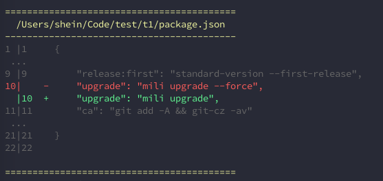

<p align="center" style="padding-top: 40px">
  
</p>

<h1 align="center" style="text-align: center">Mili</h1>

[](https://www.npmjs.com/package/mili)
[](https://www.npmjs.com/package/mili)
[](https://www.npmjs.com/package/mili)
[](https://coveralls.io/github/Val-istar-Guo/mili)


[简体中文](./docs/zh-cn/readme.md)


**Projects that derived from the same scaffolding, have evolved over time and become different.**
Scaffolding lost control of the subsequent development of the project.
When we need to improve some of the basic functions of scaffolding(e.g. eslint rules), we need to modify each project, and even have to design a customized solution for some old projects.

Therefore, in order to improve the control ability of scaffolding for the subsequent development of the project,template can modified some files and release new template version, then project can upgrade the template version.

It is useful for team project management.

## Usage

The basic principle of mili.

<p align="center">
  
</p>

1. First, you need to design your own template or use someone else's template.
2. Make project directory and run `npx mili init template_path`.
3. Run `npx mili upgrade`, when template is out of date.
4. `mili` run the handler of file that set by tempalte, when `init` or `upgrade` template

### Init Project

Let's use a existed template.

```shell
// template in github
npx mili init github:Val-istar-Guo/mili-template.git
// template in npm
npx mili init npm:mili-template
// template in private git repository
npx mili init https://github.com/Val-istar-Guo/mili.git
```

### Upgrade

The upgrade operation is very simple to use.The effect of the upgrade is determined by the handlers configured for each file in the template configuration.

```shell
npx run upgrade
```

The handler can extract the data of the project file, or use the template file as a [mustache](https://github.com/janl/mustache.js) template to render a new project file that will cover old one.

The handlers can be flexibly and freely combined to implement a variety of initialization and upgrade modes.


### Check Before Commit

With [husky](https://www.npmjs.com/package/husky),
it is easy to verify whether the project file meets the template before commit.
Thereby ensuring the specification of the project code.

Run in terminal:
```shell
npx mili check --diff --fold
```

Or configuration in husky:

```yaml
hooks:
  pre-commit: 'npx mili check --diff --fold'
```

An example:



Run `npx mili upgrade` command will auto modify code according to the diff.


## See More

- [Command Line Interface](./docs/en/cli.md)
- [Node Interface](./docs/en/node-interface.md)
- [Template Development](./docs/en/template.md)
- [Handler](./docs/en/handler/index.md)
- Reference
  + [mili-template](https://github.com/Val-istar-Guo/mili-template): An simple mili template. This can be used as a reference for first time template writing.


## Contributing & Development

If there is any doubt, it is very welcome to discuss the issue together.
Please read [Contributor Covenant Code of Conduct](.github/CODE_OF_CONDUCT.md) and [CONTRIBUTING](.github/CONTRIBUTING.md).
Let's keep a good community environment.
