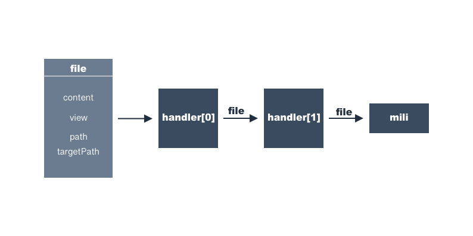

# Handlers介绍

文件信息经过handlers一层一层处理完后，输出最终文件结果到项目目录中。
Handlers为项目模版初始化/升级提供了无限可能。
这篇介绍目前支持的handler的功能。

# mustache

* 删除文件名（`file.targetPath`）中的`.mustache`后缀
* 将`file.content`作为模版，`file.view`作为数据，通过[mustache](https://www.npmjs.com/package/mustache)得到新的`file.content`
